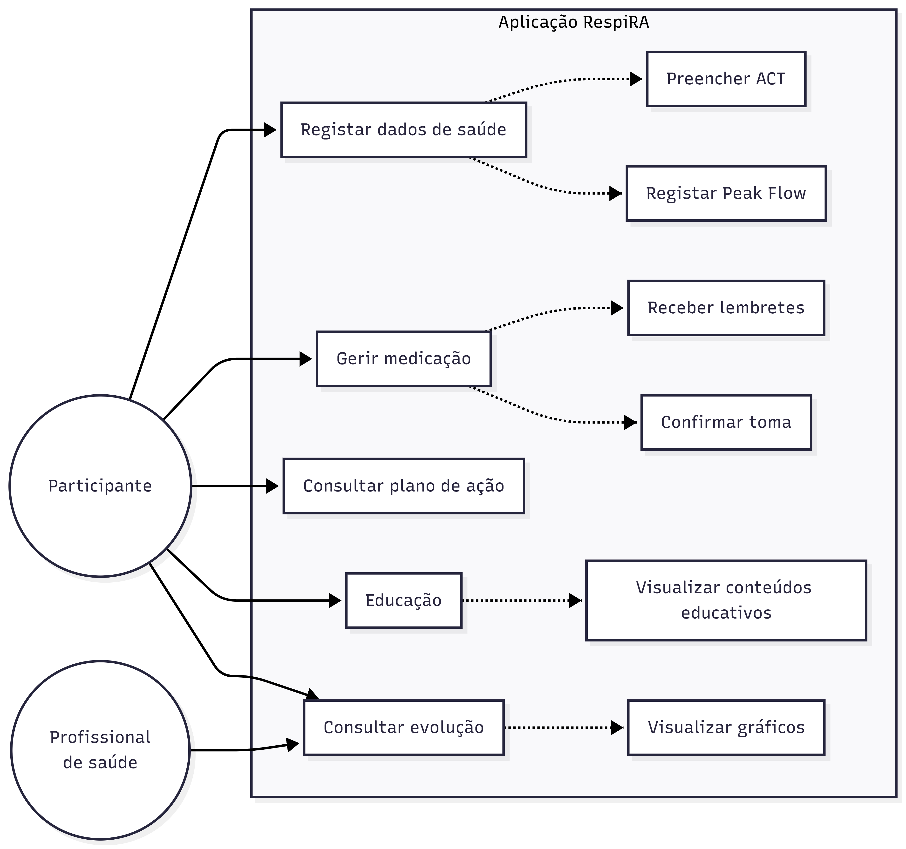
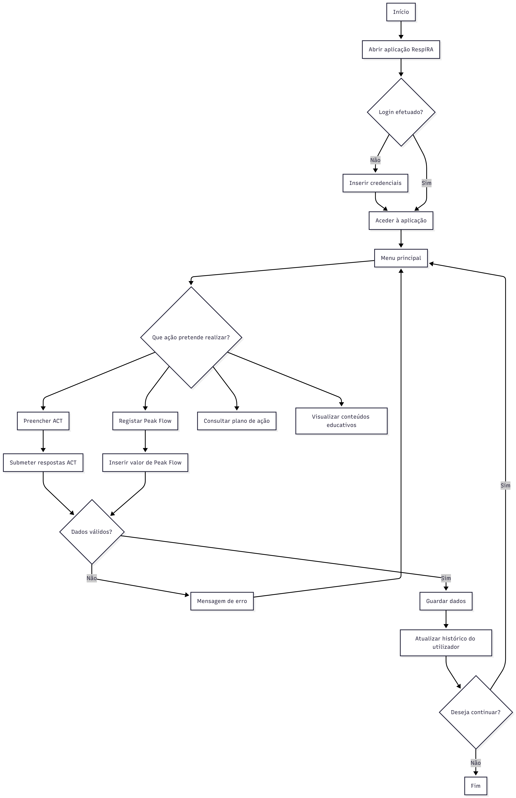
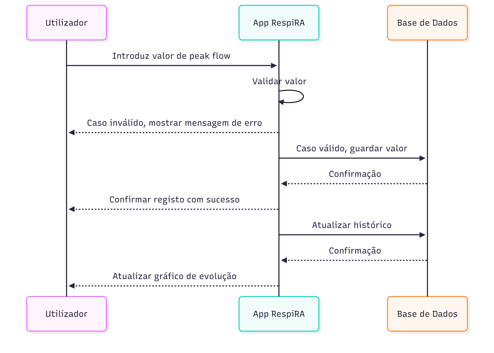

Esta página reúne os principais materiais associados ao estudo RespiRA, incluindo os instrumentos de recolha de dados, o formulário eletrónico, os diagramas funcionais, o material de suporte à Investigator's Meeting e o protótipo da aplicação.

## Investigator's Meeting

Foi preparado material de suporte para uma apresentação de 10 a 15 minutos dirigida a investigadores e equipa clínica. A apresentação resume o racional do estudo, o desenho do ensaio, os procedimentos principais, os outcomes, os materiais de recolha de dados e a demonstração guiada do protótipo RespiRA.

[Descarregar apresentação da Investigator's Meeting](materiais/investigators_meeting_respira.pptx)

Durante a demonstração, a audiência deve ser guiada pelo percurso do participante: acesso à aplicação, menu principal, registo de peak flow, validação do valor introduzido e visualização da evolução clínica.

## CRF / eCRF

O formulário de recolha de dados clínicos foi desenvolvido para estruturar a recolha das variáveis do estudo RespiRA. Inclui informação sobre critérios de elegibilidade, caracterização basal, avaliações clínicas, outcomes, exacerbações, idas à urgência e satisfação com os cuidados recebidos.

[Descarregar eCRF em PDF](materiais/ecrf_respira.pdf)

## Análise do eCRF

Foi realizada uma análise crítica do eCRF desenvolvido, com o objetivo de avaliar a estrutura do formulário, a adequação das variáveis recolhidas, a organização dos campos e a coerência com os objetivos do ensaio clínico.

[Descarregar análise do eCRF](materiais/analise_ecrf_grupo7.pdf)

## REDCap

O projeto REDCap foi configurado para permitir a recolha estruturada dos dados do estudo. O dicionário de dados define as variáveis, tipos de campo, opções de resposta e regras de codificação utilizadas no formulário eletrónico.

[Descarregar dicionário de dados REDCap](materiais/redcap_data_dictionary.csv)

## Aplicação RespiRA

A aplicação RespiRA foi desenhada para apoiar a autogestão da asma em adultos com asma moderada persistente. O objetivo é facilitar a monitorização regular da doença e apoiar o reconhecimento precoce de agravamentos.

As principais funcionalidades incluem:

- preenchimento periódico do Asthma Control Test (ACT);
- registo de valores de peak flow;
- lembretes personalizados de medicação;
- consulta de plano de ação individualizado;
- acesso a conteúdos educativos;
- visualização da evolução clínica ao longo do tempo.

## Diagramas da aplicação e do estudo

Os diagramas representam a lógica do ensaio clínico e a interação dos utilizadores com a aplicação RespiRA.

### Diagrama de atividades do ensaio

Este diagrama descreve o percurso dos participantes desde a identificação inicial, verificação dos critérios de elegibilidade, consentimento informado, randomização e acompanhamento ao longo das 12 semanas.

{width=45%}

### Fluxograma CONSORT

O fluxograma CONSORT apresenta a estrutura do ensaio, incluindo elegibilidade, alocação, seguimento e análise dos participantes.

{width=75%}

### Diagrama de casos de uso

O diagrama de casos de uso representa as principais funcionalidades da aplicação RespiRA e os atores envolvidos, nomeadamente o participante e o profissional de saúde.

{width=75%}

### Diagrama de utilização da aplicação

Este diagrama descreve o fluxo de utilização da aplicação, desde o acesso inicial até ao registo de dados, validação da informação e atualização do histórico do utilizador.

{width=55%}

### Diagrama de sequências

O diagrama de sequências detalha o processo de registo de peak flow, incluindo a interação entre utilizador, aplicação e base de dados.

{width=75%}

## Protótipo Figma

O protótipo da aplicação RespiRA está disponível através de link Figma e inclui os ecrãs principais da aplicação.

Ecrãs incluídos:

- login;
- dashboard;
- preenchimento do ACT;
- registo de peak flow;
- visualização da evolução.

[Ver protótipo da aplicação RespiRA no Figma](https://www.figma.com/proto/IWmuWSqPlOIPMdWbxvlKT8/APP-RespiRA?node-id=17-486&p=f&t=qHzF63jdHBbPLuKI-1&scaling=min-zoom&content-scaling=fixed&page-id=0%3A1&starting-point-node-id=17%3A486&show-proto-sidebar=1)
