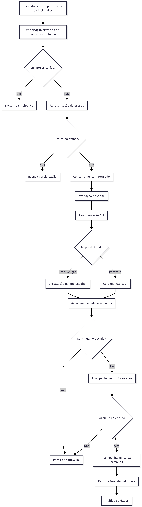
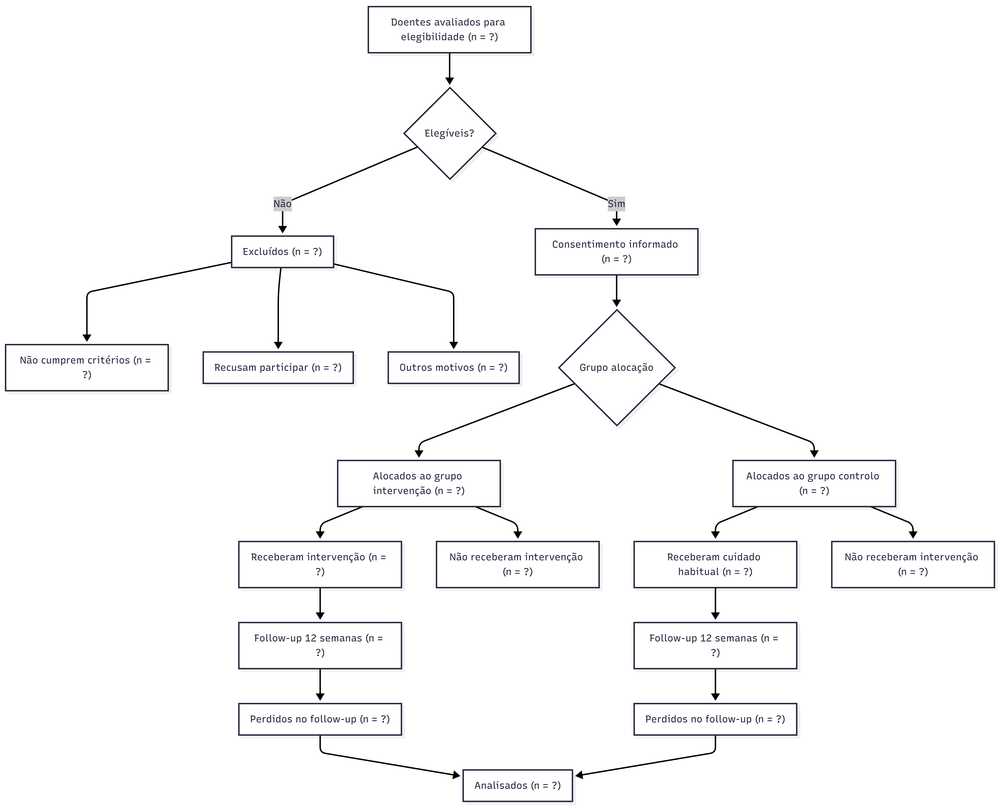

# Informação Administrativa

## RespiRA-Asma RCT

**Eficácia de uma Aplicação Móvel de Autogestão da Asma (RespiRA) versus Cuidado Habitual no Controlo da Asma Medido pelo Asthma Control Test em Adultos com Asma Moderada Persistente em Cuidados de Saúde Primários: Ensaio Clínico Randomizado**

### Autores e Afiliações

**Investigadores Principais**

- Joana Teixeira, FMUP
- Mafalda Correia, FMUP
- Rafael Batista, FMUP
- Rodrigo Freitas, FMUP

**Instituição:** Faculdade de Medicina da Universidade do Porto

**Contacto:** up202506371@up.pt

### Identificação do Ensaio

- Tipo de estudo: Ensaio clínico randomizado, controlado, paralelo
- Data de início prevista: Setembro 2026
- Data de conclusão prevista: Dezembro 2026
- Registo do ensaio: a definir antes do início do recrutamento

# Introdução

## Racional

A asma é uma doença inflamatória crónica das vias aéreas que afeta uma proporção significativa da população adulta [@asthma_burden], estando associada a limitação funcional, absentismo laboral, exacerbações recorrentes e consumo relevante de recursos de saúde. Apesar da disponibilidade de terapêuticas eficazes e de recomendações internacionais estruturadas para o seu controlo, uma percentagem substancial de doentes permanece com controlo inadequado, particularmente em contexto de cuidados de saúde primários [@gina2023].

Entre os principais fatores associados ao controlo subótimo da asma encontram-se a baixa adesão à medicação inalatória, a técnica inalatória incorreta, a monitorização irregular dos sintomas e o reconhecimento tardio de exacerbações. O acompanhamento clínico tradicional baseia-se em consultas periódicas, frequentemente espaçadas no tempo, o que limita a monitorização contínua da variabilidade sintomática e dificulta intervenções precoces. Instrumentos validados como o Asthma Control Test (ACT) permitem quantificar de forma padronizada o controlo da doença, mas a sua utilização sistemática fora do contexto de consulta é limitada [@act].

As intervenções digitais, nomeadamente aplicações móveis dirigidas à autogestão de doenças crónicas, têm demonstrado potencial para melhorar a adesão terapêutica e promover maior envolvimento do doente no controlo da sua condição [@digital_asthma; @mobile_chronic]. No entanto, a evidência disponível em asma é heterogénea e frequentemente baseada em estudos de pequena dimensão, com desenho metodológico variável e conduzidos fora do contexto real dos cuidados de saúde primários. Persiste, assim, uma lacuna quanto à eficácia de aplicações estruturadas que integrem monitorização de sintomas, registo de peak flow, lembretes de medicação, plano de ação personalizado e educação validada, avaliadas através de ensaios clínicos randomizados.

O presente estudo pretende avaliar se a utilização da aplicação RespiRA, em associação ao cuidado habitual, melhora o controlo da asma medido pelo ACT às 12 semanas, comparativamente ao cuidado habitual isolado. A escolha do cuidado habitual como comparador justifica-se por representar o *standard of care* atualmente praticado nos cuidados de saúde primários. Este estudo poderá contribuir para fundamentar a integração de ferramentas digitais na prática clínica de rotina, caso demonstre benefício clínico relevante.

# Objetivos

## Objetivo Primário

Avaliar se a utilização da aplicação RespiRA, em associação ao cuidado habitual, melhora o controlo da asma, medido pelo Asthma Control Test (ACT), às 12 semanas, comparativamente ao cuidado habitual isolado.

## Objetivos Secundários

1. Avaliar a evolução dos valores de débito expiratório máximo ao longo das 12 semanas.
2. Comparar o número de exacerbações clínicas entre os dois grupos durante o período de estudo.
3. Avaliar a taxa de adesão à medicação inalatória prescrita.
4. Comparar a qualidade de vida relacionada com a asma, medida pelo Asthma Quality of Life Questionnaire (AQLQ) [@aqlq].
5. Comparar o número de idas à urgência por agravamento da asma entre os grupos durante o período de estudo.
6. Avaliar a satisfação dos participantes com os cuidados de saúde recebidos ao longo das 12 semanas.

# Métodos

## Desenho do Estudo

Este é um ensaio clínico randomizado, controlado, de grupos paralelos.

### Características do desenho

- Randomização 1:1 (intervenção:controlo)
- Duração: 12 semanas
- *Setting*: 1 centro de saúde / Unidade de Saúde Familiar em cuidados de saúde primários
- Fase: estudo piloto (pré-teste)
- Tamanho da amostra: 30 participantes (15 por braço)

A randomização será realizada após avaliação basal, utilizando sequência gerada por computador, com ocultação da alocação. Os participantes serão acompanhados ao longo de 12 semanas, com avaliações às 4, 8 e 12 semanas.

O percurso global dos participantes, desde a identificação inicial até à análise de dados, encontra-se representado na Figura 1.

{width=45%}

*Figura 1. Diagrama de atividades do percurso dos participantes no ensaio clínico.*

O fluxograma CONSORT do estudo, incluindo os momentos de elegibilidade, alocação, seguimento e análise, encontra-se apresentado na Figura 2. Nos campos em que os valores reais ainda não estão disponíveis, é utilizada a notação `n = ?`.

{width=75%}

*Figura 2. Fluxograma CONSORT do ensaio clínico.*

### Timeline

| Fase | Momento | Duração | Descrição |
|---|---|---|---|
| Recrutamento | Antes da semana 0 | 2--4 semanas | Identificação, contacto e seleção de participantes elegíveis |
| Baseline | Semana 0 | 1 visita | Consentimento informado, avaliação inicial e randomização |
| Intervenção | Semanas 0--12 | 12 semanas | Período ativo de utilização da aplicação ou cuidado habitual |
| Follow-up | Semanas 4, 8 e 12 | 3 contactos | Avaliações às 4, 8 e 12 semanas |

## Calendarização das Avaliações no Ensaio Clínico

| Avaliação | Baseline | 4 semanas | 8 semanas | 12 semanas |
|---|---:|---:|---:|---:|
| Consentimento informado | X |  |  |  |
| Randomização | X |  |  |  |
| Asthma Control Test (ACT) | X | X | X | X |
| Peak Flow | X | X | X | X |
| Adesão à medicação | X | X | X | X |
| Exacerbações |  | X | X | X |
| Idas às urgências |  | X | X | X |
| Qualidade de vida (AQLQ) | X |  |  | X |
| Satisfação com cuidados |  |  |  | X |

# População do Estudo

## Critérios de Inclusão

Serão elegíveis para participação neste estudo indivíduos que cumpram todos os seguintes critérios:

1. Idade entre 18 e 65 anos.
2. Diagnóstico de asma moderada persistente segundo critérios clínicos e funcionais compatíveis com recomendações internacionais (ex. GINA) [@gina2023].
3. Seguimento regular no centro de saúde participante há pelo menos 6 meses.
4. Terapêutica controladora estável nas 4 semanas anteriores à inclusão.
5. Posse de smartphone compatível com sistema Android ou iOS e acesso regular à internet.
6. Literacia suficiente para compreender informação escrita em língua portuguesa.
7. Capacidade e disponibilidade para fornecer consentimento informado e participar durante 12 semanas.

## Critérios de Exclusão

Serão excluídos do estudo indivíduos que apresentem qualquer dos seguintes critérios:

1. Diagnóstico concomitante de doença pulmonar obstrutiva crónica ou outra doença respiratória crónica relevante.
2. Exacerbação grave de asma nas 4 semanas anteriores ao recrutamento, definida por necessidade de corticoterapia sistémica ou internamento.
3. Participação simultânea noutro ensaio clínico.
4. Gravidez ou lactação.
5. Incapacidade física de realizar medição de peak flow.
6. Ausência de acesso a smartphone ou internet ou incapacidade técnica significativa para utilização da aplicação.

## Processo de Recrutamento

Os participantes serão identificados através da consulta de listas de doentes com diagnóstico de asma no sistema informático do centro de saúde e através de referenciação pelos médicos de família durante consultas de seguimento. Os potenciais participantes serão contactados, informados sobre o estudo e convidados a participar. Após esclarecimento de dúvidas e assinatura do consentimento informado, será realizada a avaliação basal e subsequente randomização.

# Intervenções

## Grupo de Intervenção

Os participantes randomizados para o grupo de intervenção receberão acesso à aplicação RespiRA, desenvolvida para suporte à autogestão da asma.

A aplicação incluirá um módulo de monitorização de sintomas através do preenchimento periódico do ACT, recomendado semanalmente. O participante responderá a cinco questões padronizadas, sendo o score automaticamente calculado e armazenado.

Será disponibilizado registo diário do débito expiratório máximo, realizado com medidor de peak flow fornecido pelo estudo. O valor será introduzido manualmente na aplicação, permitindo visualização gráfica da evolução.

A aplicação integrará lembretes personalizados para a toma de medicação controladora e de alívio, configurados de acordo com a prescrição individual. O utilizador confirmará a toma na aplicação, permitindo estimativa da adesão.

Será ainda disponibilizado um plano de ação personalizado, estruturado em zonas de controlo, com recomendações específicas baseadas nos sintomas e nos valores de peak flow registados. Conteúdos educativos sobre técnica inalatória, identificação de desencadeantes e reconhecimento de exacerbações estarão acessíveis em formato digital.

A instalação será realizada no momento basal, com demonstração prática das funcionalidades. Será fornecido suporte técnico através de contacto telefónico ou email durante o período do estudo. Os participantes manterão o seu cuidado médico habitual.

As principais funcionalidades da aplicação e a interação dos utilizadores com o sistema encontram-se representadas no diagrama de casos de uso da Figura 3.

Este diagrama evidencia a interação entre o participante e o sistema, incluindo o registo de dados clínicos (ACT e peak flow), a gestão da medicação e a consulta de informação educativa. O profissional de saúde interage com o sistema através da consulta da evolução clínica, permitindo uma monitorização mais estruturada do controlo da asma.

{width=75%}

*Figura 3. Diagrama de casos de uso da aplicação RespiRA.*

O fluxo de utilização da aplicação, desde o acesso inicial até à submissão e armazenamento dos dados introduzidos pelo utilizador, encontra-se representado na Figura 4.

O fluxo inclui pontos de decisão, nomeadamente a validação dos dados introduzidos pelo utilizador, distinguindo situações válidas de entradas inválidas, com geração de mensagens de erro e necessidade de nova introdução de dados.

{width=55%}

*Figura 4. Diagrama de utilização da aplicação RespiRA.*

O processo específico de registo de peak flow, incluindo validação do valor, armazenamento e atualização do histórico, encontra-se descrito no diagrama de sequências da Figura 5.

Este processo evidencia a sequência de interações entre o utilizador, a aplicação e a base de dados, incluindo validação do valor introduzido, armazenamento dos dados e atualização do histórico clínico, garantindo consistência e rastreabilidade da informação.

{width=75%}

*Figura 5. Diagrama de sequências do registo de peak flow na aplicação RespiRA.*

## Grupo Controlo

Os participantes randomizados para o grupo controlo receberão o cuidado habitual prestado no centro de saúde, que inclui consultas médicas programadas, acesso à medicação prescrita e material educativo standard fornecido durante as consultas. Não terão acesso à aplicação durante as 12 semanas do estudo.

O cuidado habitual representa o *standard of care* atualmente praticado nos cuidados de saúde primários, constituindo o comparador apropriado para avaliar o benefício incremental da aplicação digital.

## Critérios de Descontinuação

Participantes serão retirados do estudo se:

1. Retirarem o consentimento informado.
2. Desenvolverem condição clínica que torne a participação insegura.
3. Ocorrer violação grave do protocolo que comprometa a validade dos dados.

# Avaliações e Outcomes

## Outcome Primário

### Asthma Control Test score (ACT)

- **Instrumento:** O ACT é um questionário validado [@act], avaliado no baseline, às 4, 8 e 12 semanas.
- **Outcome primário:** Diferença no score do ACT entre o baseline e as 12 semanas.
- **Momentos de avaliação principais:** Baseline e 12 semanas.
- **Definição de sucesso:** Diferença clinicamente relevante no score médio às 12 semanas entre grupos.

### Equação 1. Variação do controlo da asma

$$
\Delta ACT = ACT_{12\,semanas} - ACT_{baseline}
$$

onde:

- $ACT_{12\,semanas}$ = score do Asthma Control Test às 12 semanas;
- $ACT_{baseline}$ = score do Asthma Control Test na baseline.

Valores positivos indicam melhoria do controlo da asma.

## Outcomes Secundários

1. Valores médios de débito expiratório máximo ao longo do estudo.
2. Número de exacerbações clínicas durante 12 semanas.
3. Adesão à medicação inalatória prescrita.
4. Qualidade de vida relacionada com a asma, medida pelo AQLQ [@aqlq].
5. Número de idas à urgência por agravamento da asma.
6. Satisfação dos participantes com os cuidados de saúde recebidos.

# Análise Estatística

A análise de dados será realizada de acordo com o princípio de intenção de tratar (ITT), incluindo todos os participantes randomizados que tenham pelo menos uma avaliação pós-basal.

### Descrição da Amostra

As variáveis demográficas e clínicas basais serão resumidas através de estatística descritiva. As variáveis quantitativas serão apresentadas como média $\pm$ desvio-padrão ou mediana e intervalo interquartílico, conforme a distribuição. As variáveis qualitativas serão apresentadas como frequências absolutas e relativas (%).

### Análise do Outcome Primário

A eficácia da aplicação RespiRA será avaliada comparando a alteração no score do ACT entre o baseline e as 12 semanas.

- Será utilizado o teste t de Student para amostras independentes ou o teste de Wilcoxon-Mann-Whitney, conforme a distribuição dos dados.
- O nível de significância estatística será fixado em $p < 0{,}05$.

### Análise de Outcomes Secundários

As exacerbações e idas à urgência serão comparadas através do teste de Qui-quadrado ou teste exato de Fisher. Para a evolução do peak flow ao longo do tempo, serão utilizados modelos lineares mistos para ajustar a correlação entre medições repetidas no mesmo indivíduo.

# Ética e Disseminação

## Aprovação Ética e Consentimento

O estudo será conduzido em conformidade com a Declaração de Helsínquia. O protocolo será submetido para aprovação pela Comissão de Ética da Unidade Local de Saúde correspondente e da FMUP. Todos os participantes devem assinar o Consentimento Informado, Livre e Esclarecido antes de qualquer procedimento do estudo.

## Proteção de Dados

O tratamento de dados pessoais cumprirá o Regulamento Geral sobre a Proteção de Dados (RGPD). Os dados serão pseudonimizados, utilizando um código de identificação único. A base de dados será armazenada em servidor seguro com acesso restrito aos investigadores principais.

## Disseminação de Resultados

Os resultados serão comunicados independentemente da magnitude do efeito através de:

1. Publicação de um artigo original numa revista internacional indexada e revista por pares.
2. Apresentação em congressos científicos de Cuidados de Saúde Primários.
3. Elaboração de um sumário executivo para os participantes que manifestem interesse.

# Declaração de Utilização de Inteligência Artificial

Durante a preparação deste trabalho, ferramentas de inteligência artificial generativa foram utilizadas como apoio à revisão linguística, organização do documento, estruturação do ficheiro LaTeX e verificação da consistência formal do protocolo. A definição dos objetivos, desenho metodológico, conteúdo científico final e validação das referências permaneceram sob responsabilidade dos autores. As sugestões geradas foram revistas criticamente e adaptadas antes da submissão.

# Referências
